# HealthKart - Django E-Commerce Platform

HealthKart is a full-stack Django web application for browsing and purchasing health-related products.  
It provides user authentication, cart management, order confirmation via email, and admin/seller dashboards for managing products.

---

## Features

- Home page with product listings
- Search and filter functionality
- Add to cart, update quantity, and checkout
- User login, registration, and profile management
- Address management for users
- Purchase confirmation with email notification
- Admin and seller panels for product management
- Secure authentication and session handling

---

## Tech Stack

| Layer | Technology |
|-------|-------------|
| Frontend | HTML, CSS, Bootstrap 5 |
| Backend | Django 4.x, Python 3.x |
| Database | SQLite3 |
| Email | Gmail SMTP |
| Version Control | Git & GitHub |

---

## Setup Instructions

### 1. Clone the Repository
```bash
git clone https://github.com/harsha-0822/HealthKart-Django.git
cd HealthKart-Django
```

### 2. Create a Virtual Environment
```bash
python -m venv venv
venv\Scripts\activate       # Windows
# or
source venv/bin/activate    # Linux/Mac
```

### 3. Install Dependencies
```bash
pip install -r requirements.txt
```

### 4. Apply Migrations
```bash
python manage.py makemigrations
python manage.py migrate
```

### 5. Run the Server
```bash
python manage.py runserver
```

Then open your browser and go to:
```
http://127.0.0.1:8000/healthkart/
```

---

## Create Superuser (Admin Access)

To access the Django admin and seller panel:
```bash
python manage.py createsuperuser
```

You will be prompted to enter:
- Username
- Email address (optional)
- Password
- Password confirmation

After creating, open:
```
http://127.0.0.1:8000/admin/
```

---

## Screenshots

### Home Page


### Products Page
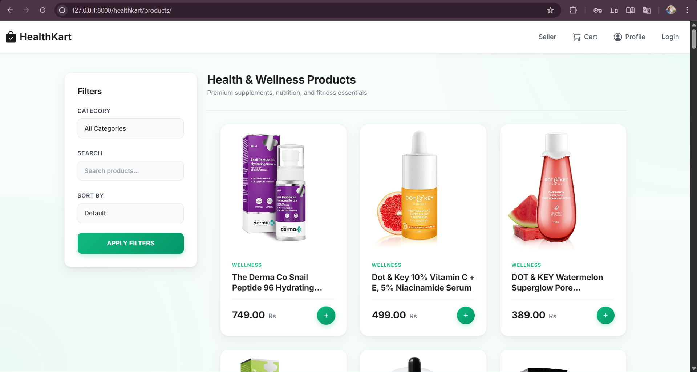

### Product Details
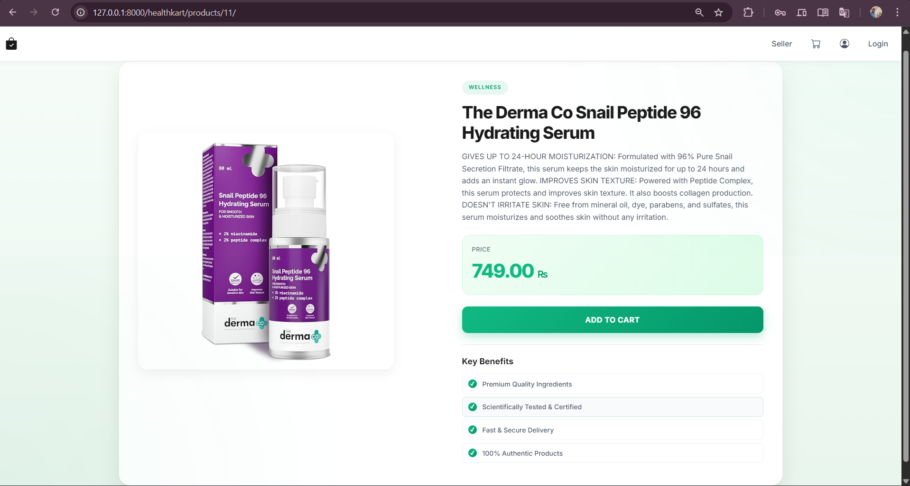

### Cart Page
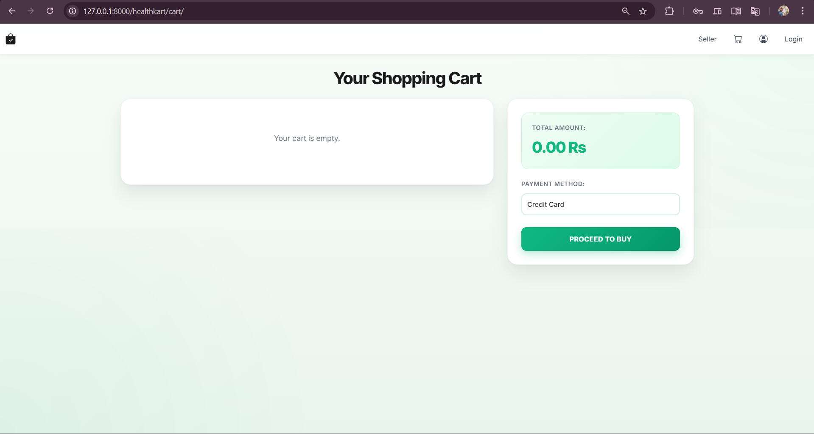

### Login Page
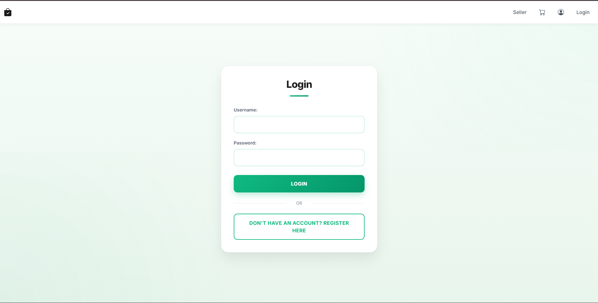

### Register Page
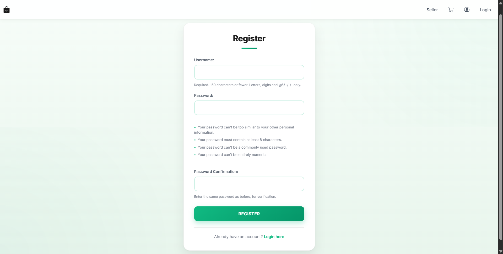

### Profile Page
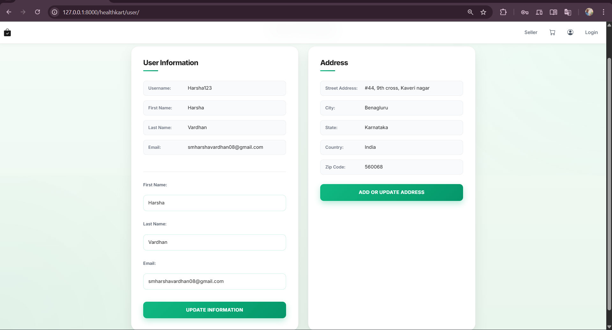

### Address Update Page
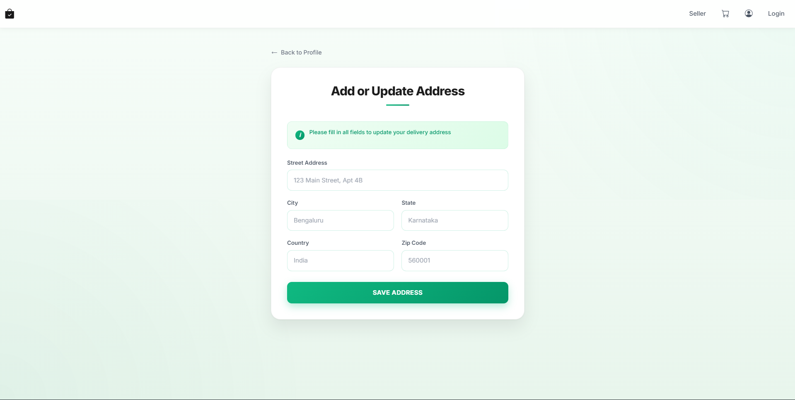

### Purchase Page
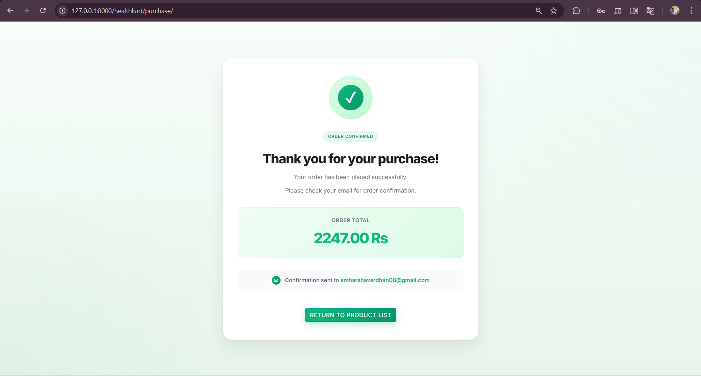

### Admin Login Page
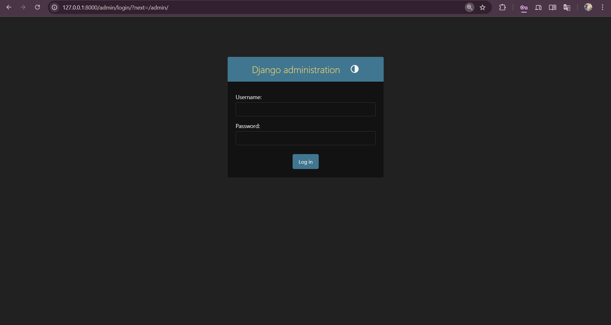

### Seller Page
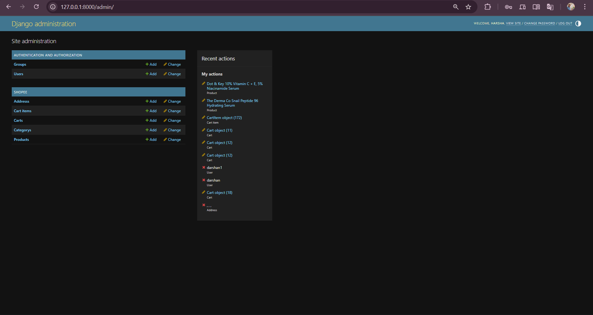

### Backend Product List
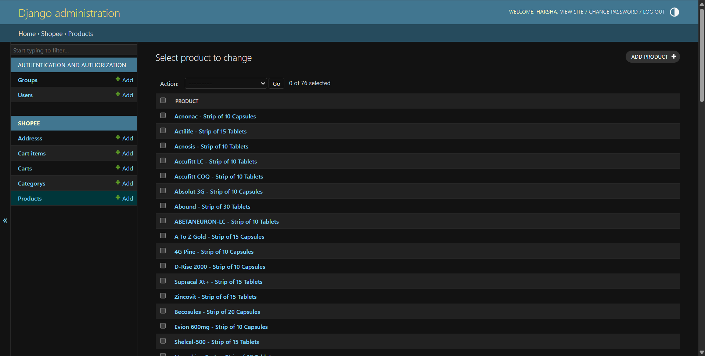

### Product Update Page
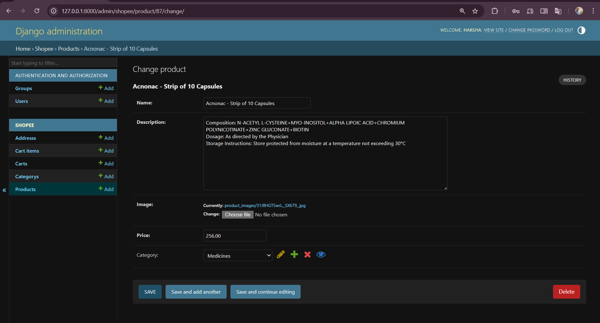

---

## Requirements

This project uses the following dependencies:

```
asgiref==3.8.1
certifi==2025.2.2
charset-normalizer==3.4.0
Django==4.1.2
django-decouple==2.1
idna==3.8
Pillow==10.4.0
python-decouple==3.8
requests==2.32.3
sqlparse==0.5.2
urllib3==2.2.3
```

Generate manually using:
```bash
pip freeze > requirements.txt
```

---

## Developer Notes

- Use Gmail App Passwords for email functionality.
- Add `.env` file for sensitive data (SECRET_KEY, EMAIL credentials).
- Set `DEBUG=False` and configure `ALLOWED_HOSTS` for production.
- Use `python manage.py collectstatic` before deployment.

---
